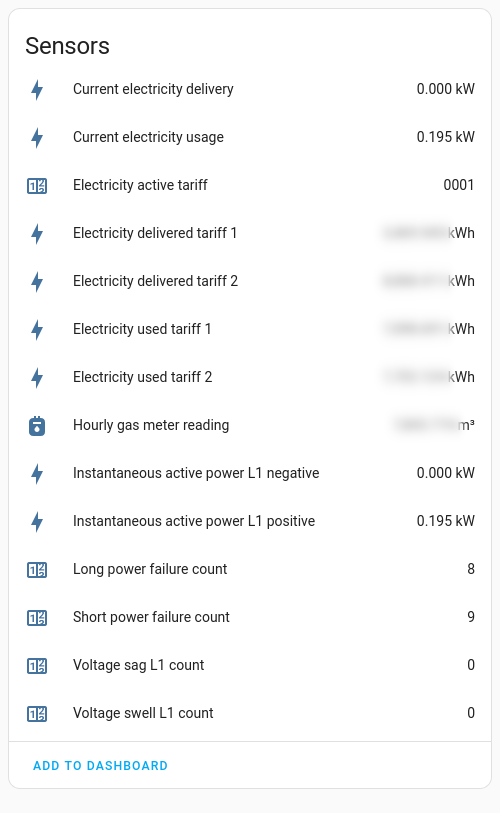

# DSMR Smart Meter MQTT Client

Lightweight containerized Dutch Smart Meter (_Slimme Meter_) to MQTT
daemon, with automatic Home Assistant integration.

Uses [paho-mqtt](https://pypi.org/project/paho-mqtt/) and
[ndokter/dsmr_parser](https://github.com/ndokter/dsmr_parser) to do the
heavy lifting.



## Is this you?
You've been running Home Assistant on a Raspberry Pi in the _meterkast_
for a while. You've hooked it up directly to your Smart Meter's P1 port
with a USB cable, and you're happily using the built-in [DSMR Slimme
Meter](https://www.home-assistant.io/integrations/dsmr/) integration.

But now you want to move Home Assistant to a server in the attic, without
physical access to your Smart Meter. You want to keep using your Raspberry
Pi to read the Smart Meter, and want to use the MQTT protocol to send the
data upstairs. You want a turn-key, easy to configure, well-engineered
application for the job.

In that case mqtt4dsmr is right for you!

## Usage
### Trying it out
The example uses `podman` since I'm more familiar with it than `docker`,
but they should be relatively interchangeable.

When using rootless containers, make sure your user has the right group
membership to access serial ports (this is why the `--group-add` option
is there). On Fedora Linux this group is called `dialout`.

```
podman run -d                                             \
    --name mqtt4dsmr                                      \
    --group-add keep-groups                               \
    --tz=local                                            \
    --env MQTT_HOST=mqtt.home.example.org                 \
    --env MQTT_PORT=1883                                  \
    --env MQTT_USERNAME=my_user                           \
    --env MQTT_PASSWORD=my_password                       \
    --device /dev/serial/by-id/usb-MY_DEVICE:/dev/ttyDSMR \
    ghcr.io/antonijn/mqtt4dsmr
```

### Automated execution (docker-compose)
If you have little experience with containers and/or are running on
Raspberry Pi OS, this is the recommended method.

Example `compose.yaml`:

```yaml
version: "3"

services:
  mqtt4dsmr:
    image: "ghcr.io/antonijn/mqtt4dsmr:latest"
    environment:
      MQTT_HOST: "mqtt.home.example.org"
      MQTT_PORT: "1883"
      MQTT_USERNAME: "my_user"
      MQTT_PASSWORD: "my_password"
    devices:
      - "/dev/serial/by-id/usb-MY_DEVICE:/dev/ttyDSMR"
    restart: always
```

Use additional environment variables as required, per the documentation
below.

Run `docker compose up -d` to start the application. There are multiple
ways to enable docker compose at system start-up. One method is to place
the above configuration in `/etc/docker/compose/mqtt4dsmr/docker-compose.yml`,
and follow [this guide](https://gist.github.com/mosquito/b23e1c1e5723a7fd9e6568e5cf91180f/18a4efee062cda1a5b6807e440f891fd6bfb4f78).
Running `systemctl enable --now docker-compose@mqtt4dsmr` should then
do the trick.

### Automated execution (Quadlet)
Put the following in `~/.config/containers/systemd/mqtt4dsmr.container`:

```
[Unit]
Description=De Slimme Meter MQTT Client
After=network-online.target

[Container]
ContainerName=mqtt4dsmr
Image=ghcr.io/antonijn/mqtt4dsmr:latest
Annotation=run.oci.keep_original_groups=1
Environment=MQTT_HOST=mqtt.home.example.org
Environment=MQTT_PORT=1883
Environment=MQTT_USERNAME=my_user
Environment=MQTT_PASSWORD=my_password
AddDevice=/dev/serial/by-id/usb-MY_DEVICE:/dev/ttyDSMR
Timezone=local

[Service]
Restart=always

[Install]
WantedBy=default.target
```

Use additional environment variables as required, per the documentation
below.

Enable the container using `systemctl --user start mqtt4dsmr`. To
automatically start the daemon at system start-up while using rootless
containers, enable lingering for your user: `loginctl enable-linger <my-user>`.

## Options
Options must be given to the container as environment variables.
<table>
<tr>
<td>Option</td>
<td>Description</td>
<td>Default</td>
</tr>
<tr>
<td>

`MQTT_HOST`

</td>
<td>

IP address or URL for MQTT broker.

</td>
<td>
</td>
</tr>
<tr>
<td>

`MQTT_PORT`

</td>
<td>

Broker MQTT port. If set to 8883 and `MQTT_TLS` is not
explicitly defined, then `MQTT_TLS` defaults to `true`. (Optional)

</td>
<td>

1883

</td>
</tr>
<tr>
<td>

`MQTT_USERNAME`

</td>
<td>

MQTT username. (Optional)

</td>
<td>
</td>
</tr>
<tr>
<td>

`MQTT_PASSWORD`

</td>
<td>

MQTT password. (Optional if `MQTT_USERNAME` is not set)

</td>
<td>
</td>
</tr>
<tr>
<td>

`MQTT_TLS`

</td>
<td>

Use MQTT over TLS. If set to `true` and `MQTT_PORT` is not
explicitly defined, then `MQTT_PORT` defaults to 8883. (Optional)

</td>
<td>

`false`

</td>
</tr>
<tr>
<td>

`MQTT_TLS_INSECURE`

</td>
<td>

Disable hostname verification for MQTT over TLS. (Optional)

</td>
<td>

`false`

</td>
</tr>
<tr>
<td>

`MQTT_CA_CERTS`

</td>
<td>

CA bundle file for broker verification. Only relevant for MQTT
over TLS. (Optional)

</td>
<td>

system CA bundle

</td>
</tr>
<tr>
<td>

`MQTT_CERTFILE`

</td>
<td>

Client certificate for authentication. (Optional)

</td>
<td>
</td>
</tr>
<tr>
<td>

`MQTT_KEYFILE`

</td>
<td>

Client keyfile for authentication. (Optional)

</td>
<td>
</td>
</tr>
<tr>
<td>

`MQTT_TOPIC_PREFIX`

</td>
<td>

Topic prefix for application MQTT traffic. You should probably
not change the default values unless you know it will conflict.
(Optional)

</td>
<td>

`dsmr`

</td>
</tr>
<tr>
<td>

`HA_DEVICE_ID`

</td>
<td>

Home Assistant internal device ID. You should probably not
change the default values unless you know it will conflict.
(Optional)

</td>
<td>

`dsmr`

</td>
</tr>
<tr>
<td>

`HA_DISCOVERY_PREFIX`

</td>
<td>

Home Assistant discovery prefix. This should match the value
you have configured in your Home Assistant MQTT integration.
If you have not configured such a value, then don't change this
option. (Optional)

</td>
<td>

`homeassistant`

</td>
</tr>
<tr>
<td>

`DSMR_VERSION`

</td>
<td>

Dutch Smart Meter Specification version. Can be one of
`AUSTRIA_ENERGIENETZE_STEIERMARK`, `BELGIUM_FLUVIUS`,
`EON_HUNGARY`, `ISKRA_IE`, `LUXEMBOURG_SMARTY`, `Q3D`,
`SAGEMCOM_T210_D_R`, `SWEDEN`, `V2_2`, `V3`, `V4`, `V5`. See
[ndokter/dsmr_parser](https://github.com/ndokter/dsmr_parser)
for more information. (Optional)

</td>
<td>

`V4`

</td>
</tr>
<tr>
<td>

`SERIAL_SETTINGS`

</td>
<td>

Serial settings. Is probably related to your `DSMR_VERSION`
setting. Worth playing around with if things don't work
initially. Can be one of `V2_2`, `V4`, `V5`. See
[ndokter/dsmr_parser](https://github.com/ndokter/dsmr_parser)
for more information. (Optional)

</td>
<td>

`V4`

</td>
</tr>
<tr>
<td>

`SERIAL_DEVICE`

</td>
<td>

Path to serial device file.

**NOTE:** This option is for testing purposes only. When running in a
container, `SERIAL_DEVICE` always has the value `/dev/ttyDSMR` and
cannot be overridden. Make sure to map the host device accordingly.

</td>
<td>
</td>
</tr>
<tr>
<td>

`MESSAGE_INTERVAL`

</td>
<td>

Minimum average interval between messages in seconds. Set to positive
value to enable rate limiting. (Optional)

</td>
<td>

0

</td>
</tr>
<tr>
<td>

`LOG_LEVEL`

</td>
<td>

Logging level. Must be `DEBUG`, `INFO`, `WARNING`, `ERROR` or
`CRITICAL`. (Optional)

</td>
<td>

`INFO`

</td>
</tr>
</table>
